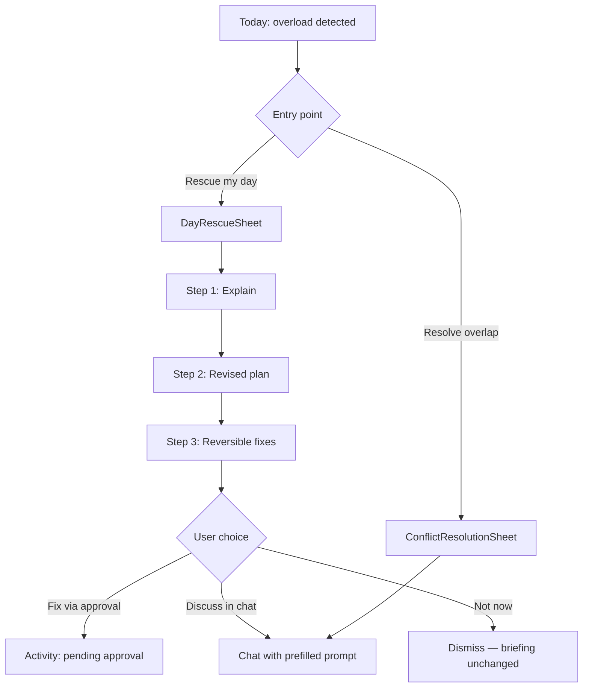

# Day Rescue mode — UI flow spec

**Status:** Spec (July 8, 2026)  
**Product source:** [`PRODUCT_DECISIONS.md`](PRODUCT_DECISIONS.md) §4 *Overloaded-day behavior*  
**Implementation anchors:** `NOBS/Views/TodayView.swift`, `NOBS/Views/ConflictResolutionSheet.swift`, `NOBS/AppModel.swift`

---

## Purpose

Deliver the launch-defining moment: **chaotic day → realistic plan in seconds.** Day Rescue is the one-tap overload path on Today — not a separate mode or personality.

---

## Product escalation (six steps)

From [`PRODUCT_DECISIONS.md`](PRODUCT_DECISIONS.md):

1. Explain the conflict or capacity problem.
2. Propose a realistic revised schedule.
3. Offer one-tap, reversible changes.
4. Adjust trusted low-priority blocks or household routines.
5. Draft communication for affected people.
6. Send only messages covered by explicitly trusted automation.

**v1 scope:** steps 1–3 only. Steps 4–6 require the automation trust ladder and comms integrations — defer with honest "coming soon" inside the flow.

---

## When Rescue appears

Show **Rescue my day** on Today when any of:

| Signal | Source today |
|--------|----------------|
| Briefing `conflictsOrRisks` contains "overload" or "heavy" | `AppModel.generateOnDeviceBriefing()` / Tank merge |
| ≥7 calendar events today | Same heuristics as `detectBriefingRisks` |
| ≥2 overlapping event pairs | `DayEvent.overlapsNext` or `buildClarifyingConflict()` |
| User taps existing **Resolve overlap** | Narrow conflict path (see below) |

Placement: below the Morning briefing card on `TodayView`, or as a prominent button inside the briefing card when overload is detected. Use `Color.nobsWarning` accent — consistent with overlap triangles on event rows.

---

## Flow overview

---

## Entry points and existing wiring

### 1. `TodayView` — primary entry

**Current:** Shows briefing sections, overlap icons on events, **Resolve overlap** when `model.clarifyingConflict != nil`.

**Add:**

- `rescueBanner` when `model.isDayOverloaded` (new computed property mirroring briefing heuristics).
- Button: **Rescue my day** → sets `model.showDayRescueSheet = true`.
- Copy: "This day looks overloaded. NOBS can help you reorder without changing anything until you confirm."

### 2. `ConflictResolutionSheet` — narrow overlap entry

**Current:** Two-option sheet (`ClarifyingConflict.optionA` / `optionB`); subtitle: "NOBS will not change your calendar until you confirm in chat." On choose → `resolveConflict(choosing:)` → chat prefill.

**Keep for single-pair overlaps.** Do not replace with full Rescue for simple A-vs-B choice.

**Extend:** Add tertiary action **Full day rescue** at bottom → dismiss conflict sheet → open `DayRescueSheet` with conflict context preloaded.

Files: `NOBS/Views/ConflictResolutionSheet.swift`, `NOBS/ConversationView.swift` (sheet presentation).

### 3. Notifications and deep links

**Current:** Clarifying notification opens chat via `NotificationDelegate`.

**Add (optional v1.1):** `nobs://rescue` sets `section = .today`, `showDayRescueSheet = true`. Notification action "Rescue my day" when overload detected in briefing payload.

---

## `DayRescueSheet` — three-step sheet

New view (or staged pages inside a `NavigationStack` sheet). Presentation: `.presentationDetents([.large])` from `ConversationView` / `TodayView`, same pattern as conflict sheet.

### Step 1 — Explain (escalation #1)

**UI:**

- Title: "Here's what's tight"
- Body: 2–4 bullets from `briefing.conflictsOrRisks` plus overload-specific copy.
- Evidence row: count of events, overlap count, optional "busiest window" (local heuristic from `AppModel`).
- Footer: "Nothing changes until you approve a fix."

**Data:** Prefer cached `DailyBriefing`; if missing, call `generateBriefing()` first.

**Acceptance:** User understands *why* the day is unrealistic without opening chat.

### Step 2 — Revised schedule (escalation #2)

**UI:**

- Title: "A realistic order"
- Show `recommendedPlan` reordered for rescue context:
  - Must-attend first (respect `ClarifyingConflict` choice if set).
  - Deprioritized blocks labeled "flexible" or "can move."
- Diff-style hint optional: "Move debrief to after lunch" (text only in v1).

**Data:**

- On-device: `buildRecommendedPlan` output from `AppModel` (extract/refactor for reuse).
- Tank refine (when connected): optional `POST /briefing/rescue` returning `{ revised_plan, deprioritized, must_attend }` — same heuristics as unified briefing module when available.

**Acceptance:** User sees a *sequence*, not another flat event list.

### Step 3 — Reversible fixes (escalation #3)

**UI:**

- Title: "Pick a fix"
- 1–3 action cards, e.g.:
  - "Suggest moving [flexible event] — needs your approval"
  - "Block 15 minutes between [A] and [B]"
  - "Open chat to replan the afternoon"
- Each card shows risk badge (low / change) matching Activity approval patterns.

**Behavior:**

| Action type | v1 behavior |
|-------------|-------------|
| Calendar nudge | Queue Tank approval (`write_workspace_note` or future calendar tool); show Activity link |
| Focus / break block | Chat prefill only (no EventKit write until approval path exists) |
| Discuss | `handleDeepLink(chatPrompt:)` with structured prefill |

**Hard rule:** No silent EventKit mutations. Match copy from `ConflictResolutionSheet`: "NOBS will not change your calendar until you confirm."

**Acceptance:** Every destructive path goes through approval or explicit chat confirmation.

---

## State and model changes (`AppModel`)

| Property / method | Purpose |
|-------------------|---------|
| `showDayRescueSheet: Bool` | Sheet presentation |
| `isDayOverloaded: Bool` | Gate Rescue CTA from briefing + events |
| `dayRescueStep: Int` | 1…3 within sheet |
| `selectedMustAttend: ClarifyingConflict.Option?` | From conflict sheet or step 1 |
| `buildDayRescuePlan() -> DayRescuePlan` | Revised plan + fix options |
| `applyRescueAction(_ action: RescueAction)` | Route to approval queue or chat |

Persist nothing new to App Group in v1 except optional `lastRescueDismissedAt` to avoid nagging twice per day.

---

## Activity and approvals integration

When a fix requires Tank:

1. Create approval with clear `reason` ("Day Rescue: move standup to free the 2pm conflict").
2. Navigate user to Activity segment or show inline confirmation.
3. On deny: return to Today with briefing intact.
4. On approve: log sync activity receipt with Local/Tank label (existing `SyncActivityEntry` pattern).

Reuse `ApprovalsView` risk badges and expandable arguments — no duplicate approval UI inside the sheet.

---

## Accessibility and tone

- VoiceOver: each step is a single logical container; actions announce approval requirement.
- Copy: warm, no guilt — aligned with evening wrap-up tone.
- Response length: respect `UserProfile.accessibilityPreferences.responseLength` for bullet counts (same as briefing lists).

---

## Out of scope (v1)

- Steps 4–6 (trusted automation, drafts, send).
- Live Activity ("Rescue in progress").
- "Fix my afternoon" scoped variant.
- Widget interactive approve.

Label deferred steps inside step 3 as "Coming soon — I'll draft a message once you trust routine sends."

---

## Verification checklist

- [ ] Overload fixture shows Rescue CTA on Today.
- [ ] Step 1–3 navigation works; back dismiss preserves calendar.
- [ ] Conflict sheet → Full day rescue handoff preserves selected overlap context.
- [ ] Resolve overlap still prefills chat for simple A/B choice.
- [ ] No EventKit write without approval path.
- [ ] Privacy receipt on any Tank-assisted replan.
- [ ] `./scripts/build-ios-simulator.sh` green.

---

## Related docs

| Doc | Role |
|-----|------|
| [`PRODUCT_DECISIONS.md`](PRODUCT_DECISIONS.md) | Six-step escalation authority |
| [`VERTICAL_SLICES.md`](VERTICAL_SLICES.md) | Slice acceptance criteria |
| [`CURRENT_STATE.md`](CURRENT_STATE.md) | What exists today |
| [`BRIEFING_SLICE_SPEC.md`](BRIEFING_SLICE_SPEC.md) | Morning briefing contract |
