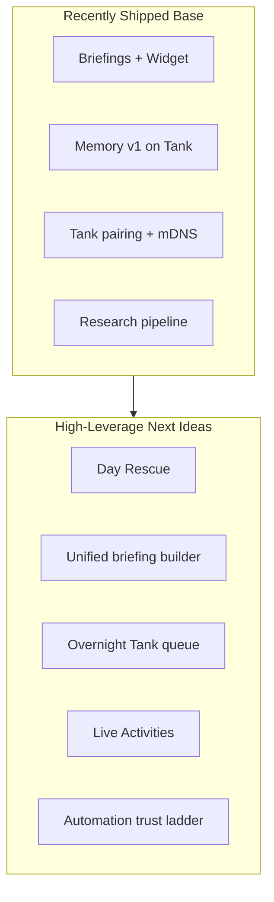

# NOBS feature brainstorm

**Status:** Product and engineering input  
**Captured:** July 8, 2026  
**Purpose:** Ranked new ideas grounded in shipped work, product decisions, and gaps — with a suggested priority order for what to build next.

**Related:** [`PRODUCT_DECISIONS.md`](PRODUCT_DECISIONS.md) (product truth), [`CURRENT_STATE.md`](CURRENT_STATE.md) (implementation truth), [`VERTICAL_SLICES.md`](VERTICAL_SLICES.md) (next two specs), [`DAY_RESCUE_SPEC.md`](DAY_RESCUE_SPEC.md) (overload UI flow).

---

## Foundation (recently shipped)

- **Daily rhythm:** Morning + evening briefings, Today widget, Focus-aware behavior, clarifying notifications
- **Tank:** Chat, memory CRUD, research jobs, HA read-only `/home/devices`, approval enrichment, scheduler with local timezone, pairing codes, `/ready` dependency checks, stale approval recovery
- **Trust:** Visible Local/Tank routing, privacy receipts, honest offline fallback
- **Apple:** App Intents/Siri, WidgetKit; Foundation Models routing on macOS NOBSTankMac

Also see [`APPLE_PLATFORM_BRAINSTORM.md`](APPLE_PLATFORM_BRAINSTORM.md) and [`NOBS_Apple_Integration_Map.md`](NOBS_Apple_Integration_Map.md) for ranked Apple-native capabilities.

---

## A. Signature user moments (tell-a-friend)

Reinforces the launch moment from [`PRODUCT_DECISIONS.md`](PRODUCT_DECISIONS.md): *chaotic day → realistic plan in seconds.*

| Idea | What it is | Why it matters | Build on |
|------|------------|----------------|----------|
| **Day Rescue mode** | One tap from Today when overload detected: explain conflict → revised schedule → 1–3 reversible fixes | Product six-step escalation; Today has conflicts but not full rescue flow | Briefing heuristics, `ConflictResolutionSheet`, approval queue — see [`DAY_RESCUE_SPEC.md`](DAY_RESCUE_SPEC.md) |
| **"Fix my afternoon"** | Chat intent: re-sequence remaining blocks only | Lower scope than full-day rescue; great demo | EventKit + briefing coordinator |
| **Commitment radar** | Surface promises from chat/calendar with gentle nudge | Bridges chat + calendar; unique vs Siri | Memory v1 + EventKit sync |
| **Sourced mini-brief** | "Tank read 3 links — here's the 60-second version" | Reinforcing moment from product doc | `POST /research`, Activity tab |
| **Trip / disruption mode** | Flight delay or calendar blow-up triggers coordinated replan | Stress-test for "one assistant" identity | Live Activity + briefing + approvals |

---

## B. Daily rhythm (morning → day → evening)

| Idea | What it is | Notes |
|------|------------|-------|
| **Weather + leave-by in briefing** | Open-Meteo in Tank tools → morning topline | [`TOOL_EXPANSION.md`](TOOL_EXPANSION.md); WeatherKit optional later |
| **Commute window** | "Leave by 8:12" from calendar + MapKit travel time | Tier 2 in Apple brainstorm; permission-gated |
| **Spoken briefing toggle** | Read briefing aloud via `AVSpeechSynthesizer` | Accessibility + hands-free morning |
| **Wind-down routine** | Evening briefing → optional Focus / Home scene (approval-gated) | Pairs wrap-up with smart home |
| **Quiet hours contract** | Never interrupt X–Y except urgent | Reduces notification fatigue |
| **Week-at-a-glance Sunday preview** | Lightweight weekly briefing | Extends briefing `kind` pattern |
| **Tank-down mode** | When `/ready` fails, show degraded mode + queued work count | Extends honest fallback pattern |

---

## C. Trust and automation (approvals → trusted actions)

Product gate: no email/messages/health until approvals UX is solid — prepare the ladder.

| Idea | What it is | Sequence |
|------|------------|----------|
| **Automation trust ladder UI** | Activity: Suggested → Approved once → Always allow → Revoked | Visualizes product trust progression |
| **First trusted write: calendar nudge** | Move low-priority block via approval → later "always for Focus overflow" | Smallest reversible calendar write |
| **Draft-only comms** | Tank drafts reply in chat; never sends | Pre-email integration |
| **Privacy receipt history** | Exportable log of routes, categories, memories, approvals | Differentiator vs cloud assistants |
| **Household context zones** | Tag memories/events personal vs shared | Required before multi-user Home |
| **"Pause NOBS" panic control** | One phrase stops proactivity for 24h | Trust safety valve |

---

## D. Tank differentiation (why Tank exists)

| Idea | What it is | Technical home |
|------|------------|----------------|
| **Overnight queue** | Before bed: "Research X, summarize my week"; results in morning Activity | Scheduler + research + notifications |
| **Unified briefing builder** | Single `app/briefing.py` for `/briefing`, scheduler, iOS alignment | Fixes scheduler/briefing duplication — see [`VERTICAL_SLICES.md`](VERTICAL_SLICES.md) |
| **Home control from chat** | "Turn off office lights" → approval → HA tool | `app/home_assistant.py`, Home tab |
| **Conversational routines** | "Every weeknight at 10pm, dim lights" → schedule + approval | Extends `/schedules` + HA |
| **Tank activity feed on dashboard** | "Last night: 1 briefing, 2 research jobs, 0 approvals" | `dashboard/dashboard.js` + agent store |
| **Model router UI (advanced)** | Pick chat vs coding model per task; show in privacy receipt | WWDC26 routing vision |
| **Evaluation harness** | Prompt/regression suite for briefing quality and tool safety | Backlog Epic |
| **MCP allowlist (careful)** | One trusted MCP behind approval | Long-term; high security cost |

---

## E. Apple surfaces (distribution + habit)

| Idea | Surface | User win |
|------|---------|----------|
| **Live Activity: approval waiting** | ActivityKit | "Tank wants to change 1 thing" on Lock Screen |
| **Live Activity: day rescue** | ActivityKit | Time-bounded overload fix in progress |
| **Share Sheet → Research** | Share extension | Share URL; Tank researches while user moves on |
| **Watch complication** | watchOS | Next priority + "brief me" (read-only) |
| **CarPlay readout** | CarPlay | Spoken briefing only |
| **Spotlight for Memory** | Core Spotlight | Find approved memories from system search |
| **Interactive widget actions** | WidgetKit | "Accept suggested fix" opens chat (defer calendar mutation) |
| **Siri: "What did Tank do overnight?"** | App Intents | Surfaces Activity without opening app |

---

## F. Memory and personalization (v2 ideas)

Memory v1 is on Tank; iOS Memory tab is still coming soon — see [`CURRENT_STATE.md`](CURRENT_STATE.md).

| Idea | Description |
|------|-------------|
| **Memory proposals** | NOBS suggests "Should I remember you prefer morning meetings?" → user approves |
| **Memory categories in UI** | Filter Memory tab: preferences, people, household, work |
| **Memory in briefing receipt** | Today shows "Used 2 preferences" with tap-through |
| **CloudKit sync (later)** | Approved memories + tone prefs only |
| **Learning check-ins** | "Did shortening responses help?" after 1 week |

---

## G. Commercial and household (honest boundaries)

| Idea | Status |
|------|--------|
| **NOBScloud entitlement sync** | StoreKit exists; backend gating needed |
| **Household identity** | Shared Tank, per-person tokens, shared Home context |
| **Tips / support flow polish** | Align with TestFlight → App Store path |
| **NOBSbox teaser** | Website + in-app "your hardware, your rules" without vapor |

---

## Priority matrix (impact vs effort)

### Quick wins (1–2 weeks each)

1. Weather in morning briefing (Tank tool already exists)
2. Unified briefing module (scheduler = same quality as iOS)
3. Home control from chat (approval-gated; HA backend ready)
4. Tank activity feed on dashboard
5. Memory proposals + category filters (v2 on existing API)
6. Share Sheet → Research (iOS extension + existing `POST /research`)

### Medium bets (2–4 weeks)

7. Day Rescue mode (overload escalation UI)
8. Overnight Tank queue + morning notification
9. Automation trust ladder in Activity
10. Live Activity for pending approvals
11. Commitment radar (memory + calendar heuristics)
12. Privacy receipt history export

### Larger / gated

13. Commute window (MapKit + location permission)
14. Email/Messages integration (after trust ladder proven)
15. HealthKit-adjacent scheduling (no medical claims)
16. Google/Alexa unification ([`GOOGLE_HOME_INTEGRATION.md`](GOOGLE_HOME_INTEGRATION.md))
17. NOBScloud + household identity

---

## Recommended next five bets (balanced portfolio)

If picking one portfolio after TestFlight/physical QA:

1. **Unified briefing builder** — fixes daily quality for scheduler + iOS (Tank)
2. **Day Rescue mode** — signature moment users feel (iOS + approvals)
3. **Overnight queue** — "Tank worked while you slept" (Tank + Activity + notification)
4. **Home control from chat** — makes Home tab real, honestly approval-gated (Tank + iOS)
5. **Live Activity for approvals** — trust + visibility without opening app (iOS)

**Next two specced as vertical slices:** items 1 and 2 in [`VERTICAL_SLICES.md`](VERTICAL_SLICES.md).

These five span Tank differentiation, daily rhythm, trust, and Apple surfaces without jumping to email/health/NOBScloud.

---

## Ideas to defer (off-brand or high risk)

- Silent email send, purchases, account deletion automation
- Arbitrary MCP / shell on Tank agent
- Full Google/Alexa until Apple Home + HA path is reliable
- Medical diagnosis or health claims
- Marketing NOBScloud before entitlement backend exists

---

## Doc index

| Document | Role |
|----------|------|
| This file | Brainstorm tables and priority portfolio |
| [`VERTICAL_SLICES.md`](VERTICAL_SLICES.md) | Next two implementation slices |
| [`DAY_RESCUE_SPEC.md`](DAY_RESCUE_SPEC.md) | Day Rescue UI flow |
| [`APPLE_PLATFORM_BRAINSTORM.md`](APPLE_PLATFORM_BRAINSTORM.md) | Ranked Apple-native ideas |
| [`PRODUCT_DECISIONS.md`](PRODUCT_DECISIONS.md) | Approved product truth |
| [`CURRENT_STATE.md`](CURRENT_STATE.md) | Shipped vs pending |
